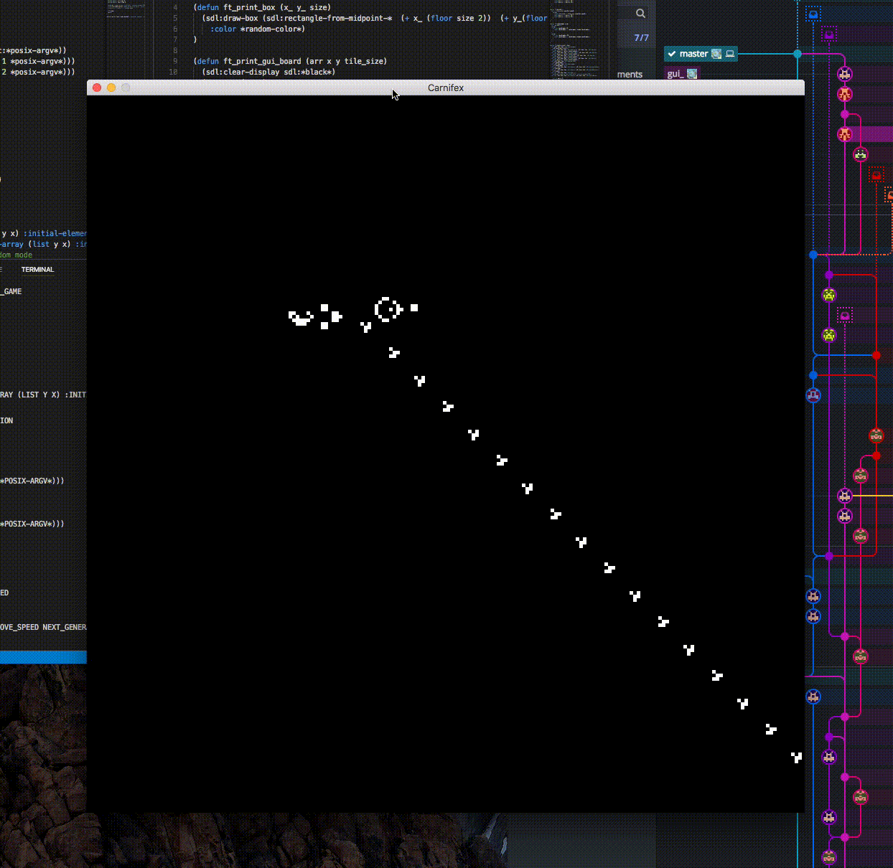
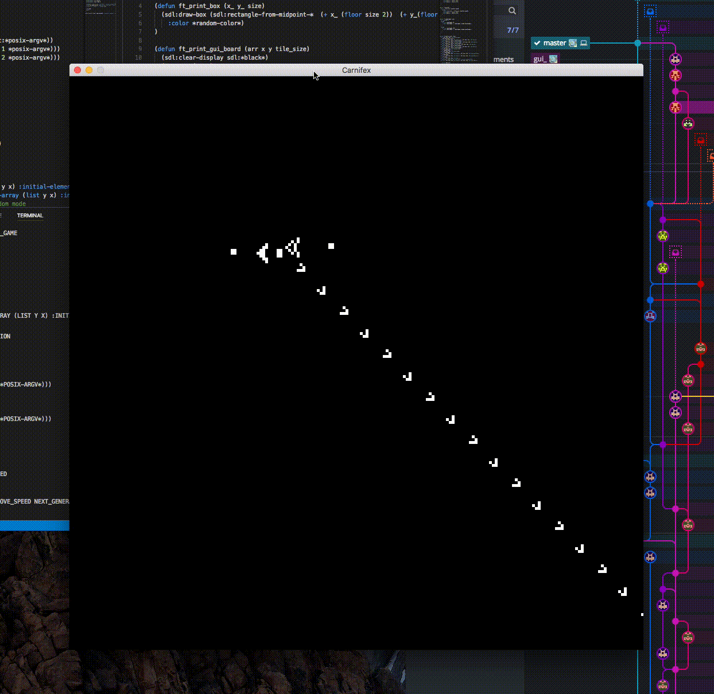

# Carnifex

<p align="center">

</p>

## What's Carnifex

Carnifex is a Conway's game of Life automaton, made in Common Lisp, in the context of a 48hours rush at [42 Paris](https://42.fr), to learn more about the subject, see [Carnifex.pdf](https://github.com/jjaniec/Carniflex/blob/master/Carniflex.pdf)

Made by [@Ashbury](https://github.com/Ashbury), [@willfree108](https://github.com/willfree108), [@iomonad](https://github.com/iomonad), [@tnicolas42](https://github.com/tnicolas42), [@UgoNic](https://github.com/UgoNic) and [me](https://github.com/jjaniec)

## Installation

### Requirements
* SDL
* sbcl or any other lisp interpreter
* quicklisp

You can download and install the SDL Library [here](https://www.libsdl.org/download-2.0.php)

[sbcl](http://www.sbcl.org/) is available on many package managers for linux users, for Mac users or if you need to compile it from source, a full tutorial is available [here](http://www.sbcl.org/getting.html) 

Once SDL and your favority lisp interpreter are installed, clone this repository
```bash
git clone https://github.com/jjaniec/Carnifex
```

and download the quicklisp library manager in the cloned directory

```bash
cd Carnifex
curl https://beta.quicklisp.org/quicklisp.lisp > quicklisp.lisp
```

Run sbcl and type in the following:
```cl
(load "/path/to/quicklisp.lisp")
(quicklisp-quickstart:install)
```

## Usage

```cl
sbcl --load ./main.lisp [-h --help -i --invert -t --traces] <width:int> <height:int>
```

### Options

```bash
-i / --invert: Invert colors
-t / --traces: Enable dying cells traces
```

## Commands

<p align="center">

</p>

### Controlling cells lives

You can use mouse clicks to change cells lives

```bash
Left click on board: Vitalize pointed cell
Right click on board: Kill pointed cell
```

### Keybindings

The following keybindings are available to control the display

```json
'e' / keypad '+': Increase zoom
'q' / keypad '-': Decrease zoom
',' / '<': Decrease cycles/second
'.' / '>': Increase cycles/second
'w' 'a' 's' 'd' / arrows / shift + mouse left click: Move camera
'r': Reset board
'esc': Exit
'p' / 'space': Play / Pause 
```

## Contributions

This project will not be maintained, but pull requests are welcome. 

For major changes, please open an issue first to discuss what you would like to change.
